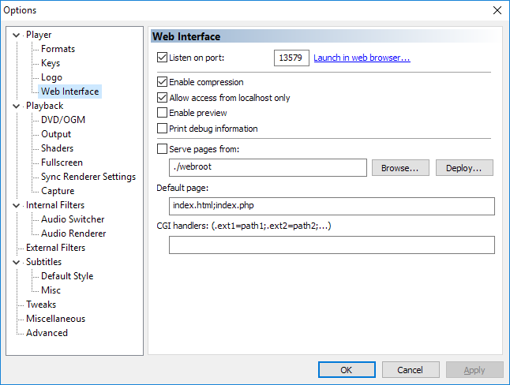

# mpc_hc

The current mpchc integration in homeassistant violates [ADR0004](https://github.com/home-assistant/architecture/blob/master/adr/0004-webscraping.md), so it will be deleted from core. This is just the existing integration copied to a separate repo. 

The name of the integration changed from `mpchc` to `mpc_hc` to solve possible name conflicts.

## Installation

It should be added to HACS at one point.

### Manual installation

Copy mpc_hc folder to your custom_components folder, and restart home-assistant.

## Notes

The main mpc-hc is unmaitained, it's recommended to use this maintained fork instead: [clsid2/mpc-hc: Media Player Classic](https://github.com/clsid2/mpc-hc)

## Usage

The `mpc_hc` platform allows you to connect a [Media Player Classic Home Cinema](https://mpc-hc.org/) to Home Assistant. It will allow you to see the current playing item, and respond to changes in the player’s state.

For this integration to function, you will need to enable the Web Interface in the MPC-HC options dialog:



If the server running Home Assistant is not the same device that is running MPC-HC, you will need to ensure that the *allow access from localhost only* option is not set.

### ⚠️ Warning

The MPC-HC web interface is highly insecure, and allows remote 
clients full player control file-system access without authentication. 
Never allow access to the Web UI from outside of your trusted network, 
and if possible [use a proxy script to restrict control or redact sensitive information](https://github.com/abcminiuser/mpc-hc-webui-proxy).

### Configuration

To add MPC-HC to your installation, add the following to your `configuration.yaml` file:

```yaml
# Example configuration.yaml entry
media_player:
  - platform: mpc_hc
    host: http://192.168.0.123
```

### Configuration Variables

| Variable | Type    | Required | Default value | Usage                                                             |
| -------- | ------- | -------- | ------------- | ----------------------------------------------------------------- |
| host     | string  | required |               | The host name or IP address of the device that is running MPC-HC. |
| port     | integer | optional | 13579         | The port number of the device.                                    |
| name     | string  | optional | MPC-HC        | The name of the device used in the frontend.                      |

## License

Apache 2

## Legacy

Original documentation can be found in [docs/original.md](docs/original.md)

Contributors of the original component are in [docs/contributors.md](docs/contributors.md)
