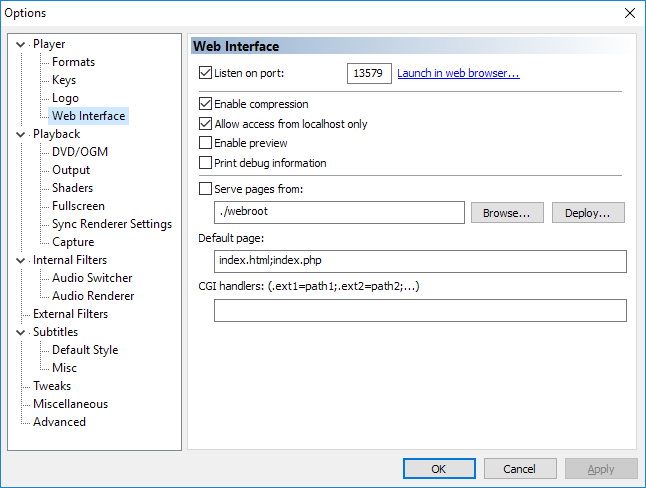

# # Media Player Classic Home Cinema (MPC-HC)

*This is just copied from the home-assistant website.*

The `mpchc` platform allows you to connect a [Media Player Classic Home Cinema](https://mpc-hc.org/) to Home Assistant. It will allow you to see the current playing item, and respond to changes in the player’s state.

For this integration to function, you will need to enable the Web Interface in the MPC-HC options dialog.



If the server running Home Assistant is not the same device that is running MPC-HC, you will need to ensure that the *allow access from localhost only* option is not set.

### ⚠️ Warning

The MPC-HC web interface is highly insecure, and allows remote 
clients full player control file-system access without authentication. 
Never allow access to the Web UI from outside of your trusted network, 
and if possible [use a proxy script to restrict control or redact sensitive information](https://github.com/abcminiuser/mpc-hc-webui-proxy).

To add MPC-HC to your installation, add the following to your `configuration.yaml` file:

```yaml
# Example configuration.yaml entry
media_player:
  - platform: mpchc
    host: http://192.168.0.123
```

### Configuration Variables

[Looking for your configuration file?](https://www.home-assistant.io/docs/configuration/)

**host** string **Required**

The host name or IP address of the device that is running MPC-HC.

**port** integer (Optional, default: 13579)

The port number of the device.

**name** string (Optional, default: MPC-HC)

The name of the device used in the frontend.
